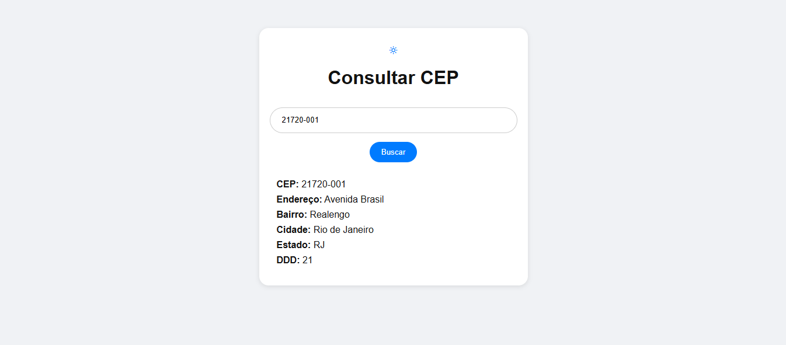
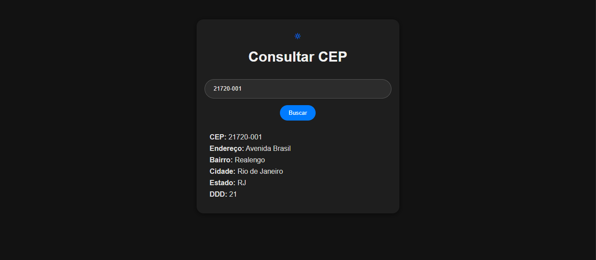

# Consultar CEP

Consultar CEP é um projeto simples e funcional que permite buscar informações detalhadas de um endereço a partir do número do CEP utilizando a API pública ViaCEP. O objetivo é oferecer uma solução prática e acessível para consultar rapidamente dados como logradouro, cidade, estado, bairro e DDD.

## Índice

- [Visão Geral](#visão-geral)
  - [Imagens](#imagens)
- [Funcionalidades](#funcionalidades)
- [Tecnologias Utilizadas](#tecnologias-utilizadas)
- [Começando](#começando)
  - [Instalação](#instalação)
- [Contribuindo](#contribuindo)
- [Contato](#contato)

## Visão Geral

Este projeto foi desenvolvido com foco em simplicidade e usabilidade. Ideal para desenvolvedores iniciantes, estudantes ou qualquer pessoa que precise realizar uma consulta de CEP de forma rápida e eficiente.

[Repositório - Consultar CEP](https://github.com/DalioSY/consultar-cep)

## Imagens

Aqui estão algumas imagens do projeto:

<div>
    
    
</div>

## Funcionalidades

- Consulta de endereço a partir do CEP.
- Exibição de dados como endereço, bairro, cidade, estado e DDD.
- Suporte a modo claro e escuro (light/dark mode).
- Interface limpa e intuitiva.

## Tecnologias Utilizadas

- HTML
- CSS
- JavaScript
- API ViaCEP

## Começando

### Instalação

1. Clone este repositório

```bash
git clone https://github.com/DalioSY/consultar-cep.git